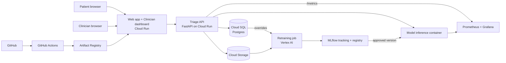
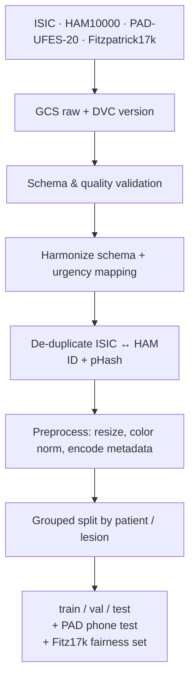
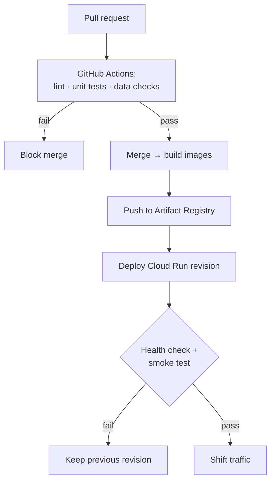

# SkinSort

**Urgency-based triage for teledermatology review queues.**
IE7374 Machine Learning Operations · Team 18 · Northeastern University

> **Academic prototype.** SkinSort is a student project built on public, de-identified research datasets. It is not a medical device, is not FDA-cleared, is not HIPAA-compliant, and must not be used on real patients. Several source datasets are licensed for non-commercial use only.

---

## Overview

Dermatology referrals are usually reviewed first-come, first-served, so a possible melanoma can wait behind dozens of harmless moles. SkinSort reorders that line.

1. A patient uploads a smartphone photo of a skin lesion and answers four questions (duration, change, itch/pain/bleeding, other similar spots).
2. An image-quality gate rejects blurry or dark photos and asks for a retake.
3. A multimodal model (image + answers) outputs calibrated probabilities for **routine / priority / urgent**.
4. A safety rule promotes any case with `P(urgent) ≥ τ` to urgent.
5. Cases enter a dermatologist-only review queue sorted by urgency, with aging so routine cases are never stuck.
6. The dermatologist reviews **every** case; disagreements are logged and feed retraining.

The patient never sees a score, position, or diagnosis. SkinSort does not replace the doctor — it decides which case the doctor opens next.

The course focus is the full MLOps lifecycle: versioned data, tracked experiments, cloud serving, CI/CD, monitoring, and a human-approved retraining loop.

---

## Architecture



| Component | Role |
|---|---|
| **Web app** (Cloud Run) | Patient upload page and dermatologist dashboard; scales to zero |
| **Triage API** (FastAPI, Cloud Run) | Receives cases, stores them, calls the model, computes queue keys, exposes metrics |
| **Inference service** (Docker) | Serves the production model; deployable independently of the API |
| **Cloud Storage** | Uploaded photos and all dataset versions (raw / processed / splits) |
| **Cloud SQL** (PostgreSQL) | Cases, tiers, queue keys, clinician decisions, overrides |
| **Vertex AI** | On-demand GPU training and retraining jobs |
| **MLflow** | Experiment tracking and model registry |
| **DVC** (GCS remote) | Data versioning and reproducible pipeline |
| **GitHub Actions + Artifact Registry** | CI (lint, tests, data checks) and image builds |
| **Prometheus + Grafana** | System, data-drift, model and fairness monitoring with alerts |

### Queue logic

```
tier = URGENT              if P(urgent) >= tau      # safety override
     = argmax(P)           otherwise

key  = BASE[tier] + w * P(urgent) - alpha * arrival_time
```

Cases sit in a max-heap backed by Cloud SQL (nothing is lost on restart). If the model service is unavailable, cases are saved and queued FIFO. `tau`, `BASE`, `w`, and `alpha` live in `configs/` and are tuned during testing.

---

## Datasets

| Dataset | Size | Image type | Role | License |
|---|---|---|---|---|
| [ISIC Archive](https://www.isic-archive.com) | ~70k (subset) | Dermoscopic | Main training data | CC-0 / CC-BY / CC-BY-NC (per image) |
| [HAM10000](https://doi.org/10.7910/DVN/DBW86T) | 10,015 | Dermoscopic | Extra training data, de-duplicated against ISIC | CC BY-NC 4.0 |
| [PAD-UFES-20](https://doi.org/10.17632/zr7vgbcyr2.1) | ~2,300 | Smartphone | Patient answers (stage-2 training) + phone-photo test set | CC BY 4.0 |
| [Fitzpatrick17k](https://github.com/mattgroh/fitzpatrick17k) | ~16,500 | Clinical | Held-out skin-tone fairness evaluation only | Non-commercial research |

Fitzpatrick17k images are hosted by third parties and are **not** redistributed by this repo. All datasets are credited here and in the final report.

### Diagnosis → urgency mapping (draft)

| Diagnosis | Tier |
|---|---|
| Melanoma | Urgent |
| Squamous cell carcinoma | Urgent |
| Basal cell carcinoma | Priority |
| Actinic keratosis | Priority |
| Nevi and other benign lesions | Routine |

The mapping is versioned in `configs/` and recorded with every training run. It will be validated against a published clinical source before final submission.

---

## Data Pipeline



- **Ingest:** one script per source, with checksums.
- **Validation:** columns, image integrity, and label sanity; the pipeline halts on failure.
- **De-duplication:** ID match plus perceptual hash to stop train/test leakage.
- **Splits:** ~70/15/15, grouped by patient/lesion. An automated test fails on any overlap. Test sets are frozen across retrains.
- **Class imbalance:** urgent cases are up-weighted during training.
- **Augmentation:** blur, crop, and brightness jitter to mimic phone photos.

GCS layout: `raw/` → `processed/` → `splits/`. Git holds only code and `.dvc` pointers.

---

## Model

Two-stage training:

1. **Image stage:** learn lesion recognition from the large dermoscopic pool (ISIC + HAM10000).
2. **Fusion stage:** add the patient-answer branch using PAD-UFES-20. Missing answers are passed as explicit "missing" indicators, never imputed.

Outputs are calibrated so `P(urgent)` can drive queue ordering. A photo-only baseline is kept for comparison; if answers don't help, we report that.

---

## Repository Structure

```
skinsort/
├── .github/workflows/   # CI: lint, tests, data checks, image builds
├── configs/             # model settings, urgency table, queue parameters
├── data/
│   ├── ingest/          # per-dataset download scripts
│   ├── raw.dvc
│   └── processed.dvc
├── src/
│   ├── data/            # cleaning, merging, de-dup, splitting
│   ├── models/          # image encoder + answers branch + fusion
│   ├── training/        # training, evaluation, fairness checks, MLflow logging
│   ├── queue/           # priority queue and override logging
│   ├── intake/          # patient form, four questions, optional chat assistant
│   └── serving/         # FastAPI triage + inference service
├── app/                 # patient upload page + clinician dashboard
├── monitoring/          # Prometheus / Grafana configs and alerts
├── notebooks/           # EDA and experiments (not used in production)
├── tests/               # unit and integration tests
├── docker/              # Dockerfiles
├── dvc.yaml             # data + training pipeline
├── docker-compose.yml   # full local stack
└── requirements.txt
```

---

## Getting Started

### Prerequisites

- Python 3.10+
- Docker and Docker Compose
- DVC with the GCS extra (`pip install "dvc[gs]"`)
- Google Cloud SDK, authenticated with an account that has access to the project bucket

### Setup

```bash
git clone https://github.com/DHEEKSHIT11/skinSort.git
cd skinSort

python -m venv .venv
source .venv/bin/activate          # Windows: .venv\Scripts\activate
pip install -r requirements.txt

gcloud auth application-default login
dvc pull                            # fetch the current data version
```

### Run the pipeline

```bash
dvc repro                           # re-runs only the stages that changed
```

### Run the stack locally

```bash
docker compose up --build
```

Starts the web app, triage API, inference service, and monitoring stack.

### Tests

```bash
pytest tests/
```

---

## CI/CD

**Code releases**



**Model releases**

1. Train on Vertex AI with a pinned DVC data version; log to MLflow.
2. Auto-compare against the production model on frozen test sets: urgent recall, calibration, skin-tone fairness.
3. Reject unless at least as good on **every** check.
4. Team member reviews and approves.
5. Promote to `Production` in the MLflow registry; the inference service loads it.

No model reaches production without human sign-off.

---

## Monitoring

| Question | Signals |
|---|---|
| Is the system working? | Request volume, p95 latency (target < 2 s), error rate, FIFO-fallback events |
| Has the input drifted? | Brightness, sharpness, color, and patient-answer distributions vs. training data |
| Is the model behaving normally? | Routine / priority / urgent mix, safety-override rate |
| Do doctors agree? | Clinician override rate (simulated in this course) |
| Is it still fair? | Override rate and accuracy by Fitzpatrick skin type |
| Is anyone waiting too long? | Queue depth per tier, age of oldest case |

Significant drift, a rising override rate, or a fairness gap triggers retraining on the newest data plus logged corrections, followed by the gated model release above.

---

## Targets & Acceptance Criteria

| Metric | Target |
|---|---|
| Urgent recall, main test set | ≥ 90% |
| Urgent recall, PAD-UFES-20 phone photos | ≥ 85% |
| Calibration error | ≤ 5% |
| Urgent-recall gap across skin tones | ≤ 5 points |
| Time to score a case | < 2 s |
| Clinic simulation | Urgent cases reviewed ≥ 2× faster than FIFO; no routine case waits beyond a set cap (e.g. 30 days) |

| Area | Accepted when |
|---|---|
| Model | Recall and fairness targets met |
| System | Sub-2 s scoring; fallback mode tested |
| Data | Automated no-overlap check passes |
| MLOps | Pipeline reproducible; monitoring live; retraining loop demonstrated end to end |
| Safety | No score or diagnosis is ever shown to the patient |

---

## Timeline

| Dates (2026) | Phase |
|---|---|
| Sep 6 – Sep 19 | Team formation & ideation |
| Sep 20 – Oct 4 | Scoping & design; GitHub, GCP, DVC, MLflow setup |
| Oct 5 – Oct 18 | Data pipeline |
| Oct 19 – Nov 1 | Photo-only baseline |
| Nov 2 – Nov 15 | Fusion model, calibration, phone-photo & fairness tests |
| Nov 16 – Nov 22 | Queue logic, fallback, API, Docker |
| Nov 23 – Nov 29 | GCP deployment, web pages |
| Nov 30 – Dec 4 | Monitoring, simulated corrections, retraining loop |
| Dec 5 – Dec 7 | Final testing, clinic simulation, report |
| **Dec 8** | **Final presentation** |

The optional LLM intake assistant is built only if the core system finishes early. Its scope is limited to asking the four questions and producing a patient-confirmed summary; it never interprets the lesion or affects the score.

---

## Privacy, Licensing & Regulation

- All data is public and de-identified by the original publishers; no real patient data is collected.
- Demo "patients" use public images with made-up or PAD-UFES-20 answers.
- HAM10000 and parts of ISIC are non-commercial; this project is strictly academic.
- A real deployment would require encryption, access control, audit logging, and a HIPAA BAA with the cloud provider, and would likely need FDA review as clinical decision support.

---

## Team

| Member |
|---|
| Bala Asrith Chavala |
| Dheepak Karan Elumalai Santhakumari |
| Elenta Suzan Jacob |
| Karuniya Premnath |
| Rahul Gudivada |
| Sai Dheekshit Reddy Antham |

---

## Acknowledgements

ISIC Archive · HAM10000 (Tschandl et al.) · PAD-UFES-20 (Pacheco et al.) · Fitzpatrick17k (Groh et al.) · IE7374 course staff, Northeastern University.
